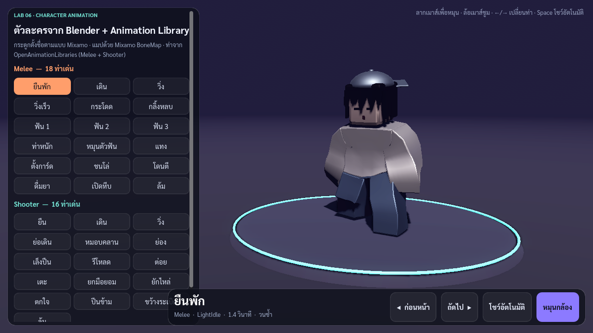

# Lab 6 — Character Animation

ตัวละครปั้นใน Blender, ริกด้วย Mixamo, เล่นท่าใน Godot 4.7.2 ด้วย [OpenAnimationLibraries](https://github.com/catprisbrey/Godot4-OpenAnimationLibraries) (Melee + Shooter)

**เล่นบนเว็บ:** https://xraphaelz.github.io/gamedev2026-project/lab6/Game/gamelab6.html

## ขั้นตอน
1. ปั้นโมเดลใน Blender (`Blender/RobloxChar.blend`)
2. export T-pose เป็น OBJ zip ส่ง Mixamo Auto-Rigger แล้วโหลดกลับเป็น FBX
3. แก้ชื่อกระดูก `mixamorig:` → `mixamorig_` แล้ว export เป็น glb
4. ใน Godot ตั้ง Retarget → Bone Map = `Mixamo BoneMap.tres`
5. เพิ่ม `MeleeLib.res` กับ `ShooterLib.res` เข้า AnimationPlayer
6. Export เว็บ

## เปิดโปรเจกต์
เปิด `CharacterDemo/project.godot` แล้วกด F5

## เครดิต
- Animation libraries / bone map: catprisbrey
- ฟอนต์ Sarabun (SIL OFL)
